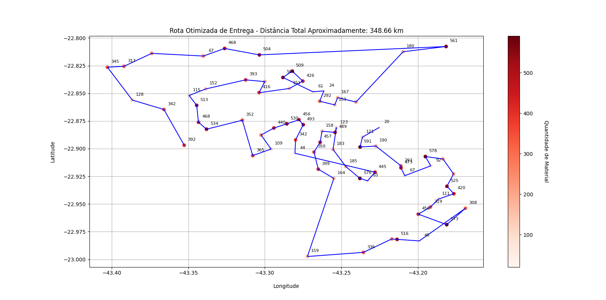
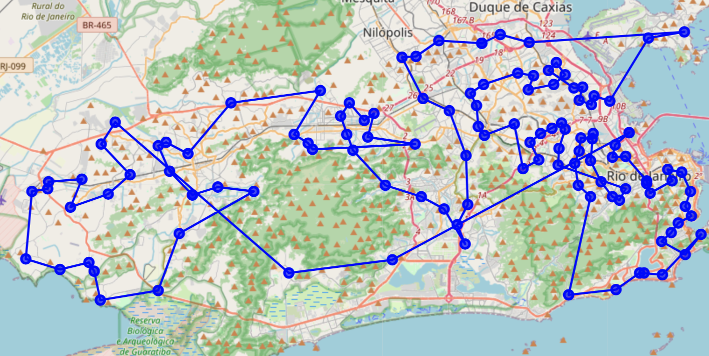

# Trabalho Final: Técnicas de programação I 💻

Alunos: Airel Ribeiro E Silva | David Dos Santos Gonzalez | Juan Daniel Da Silva Campos Ferreira Campos | Rafael De Castro Gomes

## Distribuição de Materiais Didáticos no Rio de Janeiro 🇧🇷

Este projeto visa realizar tratamentos nos dados e otimizar a distribuição de materiais didáticos nas escolas da cidade do Rio de Janeiro.

### Contexto 🚚

Uma consultoria de dados foi contratada para assegurar que os materiais didáticos sejam entregues de forma eficiente nas escolas do Rio de Janeiro. O objetivo é tratar os dados segundo normas estabelecidas pelo cliente e determinar a rota mais eficaz para o caminhão de entrega.

### Visualização da rota otimizada utilizando um gráfico 📊

Para oferecer uma representação visual clara da rota otimizada, criamos um plot utilizando a biblioteca Matplotlib. Esse gráfico proporciona uma visão intuitiva do trajeto planejado, destacando a sequência e a proximidade das escolas no percurso otimizado.

</br>
<p align="center">
  <kbd>
  
  </kbd>
  </br>
</p>
</br>

### Visualização da rota otimizada no mapa 🗺️

Utilizando a biblioteca Folium, apresentamos uma representação geográfica da rota otimizada. Com essa visualização no mapa, o caminho a ser seguido torna-se mais evidente, mostrando a sequência e disposição das escolas no percurso. Isso facilita a compreensão espacial e ajuda a identificar pontos de interesse e áreas de concentração na rota.

</br>
<p align="center">
  <kbd>
  
  </kbd>
  </br>
</p>
</br>


<details>
<summary><h2>Execução com Ambiente Virtual</h2></summary>

<details>
<summary><h3>Linux</h3></summary>

## Instale o virtualenv

Para instalar o `virtualenv`, abra o terminal e execute o seguinte comando:

```bash
pip install virtualenv
```

## Criação e Ativação de um Ambiente Virtual

Abra o terminal e navegue até o diretório raiz do projeto, lá crie o ambiente com o seguinte comando:

```bash
virtualenv venv
```

Agora ative seu ambiente virtual:

```bash
source venv/bin/activate
```

## Instlação das ferraments necessárias:

Agora você pode, ainda na pasta raiz, instalar as ferramentas necessárias para rodar a aplicação usando o arquivo requirements.txt:

```bash
pip install -r requirements.txt
```

## Desativação do ambiente virtual:

Para desativar seu ambiente virtual, basta executar o seguinte comando:

```bash
deactivate
```

</details>

<details>
<summary><h3>Windows</h3></summary>

## Instale o virtualenv

Para instalar o `virtualenv`, abra o Prompt de Comando ou PowerShell como administrador e execute o seguinte comando:

```bash
pip install virtualenv
```

## Criação e Ativação de um Ambiente Virtual

Abra o Prompt de Comando ou PowerShell e navegue até o diretório raiz do projeto, lá crie o ambiente com o seguinte comando:

```bash
virtualenv venv
```

Agora ative seu ambiente virtual:

```bash
venv/bin/activate
```

## Instlação das ferraments necessárias:

Agora você pode, ainda na pasta raiz, instalar as ferramentas necessárias para rodar a aplicação usando o arquivo requirements.txt:

```bash
pip install -r requirements.txt
```

## Desativação do ambiente virtual:

Para desativar seu ambiente virtual, basta executar o seguinte comando:

```bash
deactivate
```

</details>
</details>
